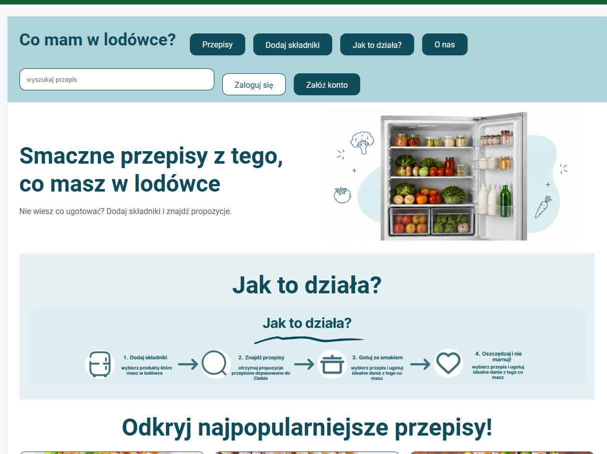
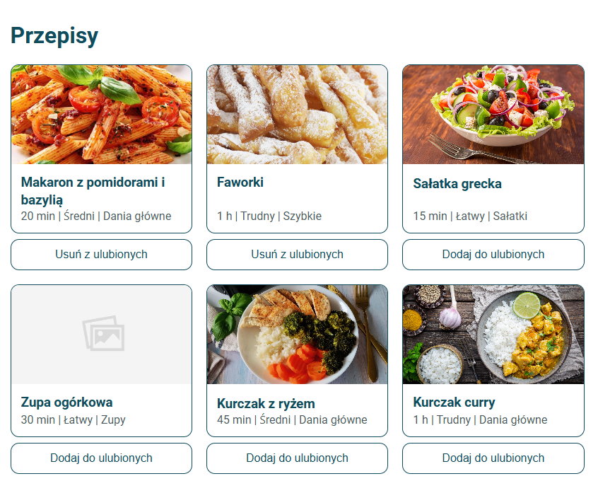

# 🧊 Co mam w lodówce?

Projekt wykonany w ramach przedmiotu:

**Techniki Projektowania Frontendowego**  
Politechnika Krakowska – Wydział Informatyki i Matematyki

Autorzy:
- Łukasz Kierzek
- Tomasz Gondek

---

## 📌 Opis projektu

„Co mam w lodówce?” to aplikacja webowa wspierająca planowanie posiłków oraz ograniczanie marnowania żywności.

Użytkownik dodaje produkty znajdujące się w swojej wirtualnej lodówce, a system proponuje przepisy dopasowane do aktualnie dostępnych składników.

Projekt zawiera:

✅ wirtualną lodówkę  
✅ wyszukiwanie przepisów  
✅ ulubione przepisy  
✅ ostatnio przeglądane  
✅ planowanie posiłków  
✅ listę zakupów  
✅ logowanie Firebase Authentication  
✅ Google Analytics  
✅ Hotjar / Contentsquare  
✅ deployment aplikacji  
✅ responsywny interfejs React + Vite

---

# 🖼 Widoki aplikacji

## Strona główna



---

## Lista przepisów



---

## Szczegóły przepisu


---

## Dodawanie składników


---

## Lista zakupów


---

## Plan posiłków


---

# 🧠 Założenia projektowe

Projekt został przygotowany na podstawie:

- analizy użytkowników
- domeny terminologii
- schematu funkcjonalnego
- architektury informacji
- makiet UI
- specyfikacji kolorystycznej
- technicznej specyfikacji interfejsu

Najważniejsze funkcje:

### Wirtualna lodówka

Pozwala przechowywać produkty:

- warzywa
- nabiał
- mięso
- produkty suche
- inne składniki

---

### Dopasowanie przepisów

System analizuje:

- produkty użytkownika
- kategorię przepisu
- poziom trudności
- czas wykonania

Na tej podstawie prezentowane są propozycje potraw.

---

### Zarządzanie posiłkami

Obsługiwane moduły:

- plan posiłków
- lista zakupów
- ulubione przepisy
- historia przeglądania
- zarządzanie składnikami

---

# 🛠 Technologie

Frontend:

- React
- Vite
- React Router DOM
- Context API

Stylowanie:

- CSS3
- komponenty wielokrotnego użycia

Integracje:

- Firebase Authentication
- Google Analytics
- Hotjar / Contentsquare

Deployment:

- Vercel

---

# 🔥 Firebase Authentication

Projekt wykorzystuje logowanie użytkownika przez Firebase.

Obsługiwane funkcje:

✅ rejestracja

✅ logowanie

✅ wylogowanie

✅ zabezpieczone trasy

✅ widoki zależne od stanu użytkownika

Po zalogowaniu użytkownik otrzymuje dostęp do:

- Moje składniki
- Ulubione
- Plan posiłków
- Lista zakupów
- Ustawienia

---

# 📈 Google Analytics

Aplikacja posiada integrację z Google Analytics.

Monitorowane są:

- wejścia użytkowników
- odsłony podstron
- routing SPA
- aktywność użytkowników

### Screeny Google Analytics

Dodaj później:

```txt
docs/analytics/google-1.png
docs/analytics/google-2.png
```


---

# 🎥 Hotjar / Contentsquare

Projekt został zintegrowany z Hotjar / Contentsquare.

Wykorzystywane funkcje:

- Session Replay
- analiza ruchu
- heatmapy
- analiza zachowania użytkownika

# Vercel
Projekt został zintegrowany z Vercel.


### Screeny Hotjar

Dodaj później:

```txt
docs/hotjar/session-replay.png
docs/hotjar/page-comparator.png
docs/hotjar/dashboard.png
```


---

# 🚀 Deployment

Aplikacja została wdrożona na Vercel.

Adres produkcyjny:

```txt
https://co-mam-w-lodowce.vercel.app
```

Repozytorium:

```txt
https://github.com/lukaskierzek/co-mam-w-lodowce
```

---

# ⚙ Tryby uruchamiania

| Tryb | Komenda | Opis |
|------|------|------|
| DEV | npm run dev | localStorage |
| DEVPROD | npx vite --mode devprod | Firebase |
| BUILD | npm run build | produkcja |

---

# 📁 Struktura projektu

```txt
src/
│
├── assets/
│
├── components/
│   ├── RecipeCard
│   ├── SideMenu
│   ├── TopNav
│
├── pages/
│   ├── HomePage
│   ├── LoginPage
│   ├── RegisterPage
│   ├── RecipeDetailsPage
│   ├── SettingsPage
│
├── services/
│
├── context/
│
├── routes/
│
└── styles/
```

---

# ▶ Instalacja

Pobranie projektu:

```bash
git clone https://github.com/lukaskierzek/co-mam-w-lodowce.git
```

Instalacja zależności:

```bash
npm install
```

Uruchomienie:

```bash
npm run dev
```

Tryb Firebase:

```bash
npx vite --mode devprod
```

Build:

```bash
npm run build
```

---

# 📚 Dokumentacja projektu

Projekt zawiera:

- analizę potrzeb użytkowników
- domenę terminologii
- architekturę informacji
- makiety
- projekt UI
- integracje Firebase
- Google Analytics
- Hotjar
- deployment

---

# 📷 Materiały do uzupełnienia przed oddaniem

## Screeny aplikacji

- [ ] Home
- [ ] Lista przepisów
- [ ] Szczegóły przepisu
- [ ] Dodawanie składników
- [ ] Plan posiłków
- [ ] Lista zakupów

## Google Analytics

- [ ] Dashboard
- [ ] Page Views
- [ ] Events

## Hotjar

- [ ] Session Replay
- [ ] Heatmaps
- [ ] Page Comparator

## Deployment

- [ ] Screen z Vercel
- [ ] Link produkcyjny

---

# 👨‍💻 Autorzy

- Łukasz Kierzek  
- Tomasz Gondek
- Adam Bohonko

Politechnika Krakowska  
Techniki Projektowania Frontendowego

2026