# Co mam w lodowce?

Aplikacja webowa do zarzadzania zawartoscia wirtualnej lodowki i wyszukiwania przepisow na podstawie dostepnych skladnikow. Projekt zostal przygotowany w React + Vite w ramach przedmiotu `Techniki Projektowania Frontendowego`.

## Zakres projektu

Na podstawie analizy kodu projekt zawiera:

- strone glowna z wyszukiwarka przepisow,
- rejestracje i logowanie,
- chronione widoki po zalogowaniu,
- wirtualna lodowke i dodawanie skladnikow,
- liste przepisow, widoki kategorii i szczegoly przepisu,
- ulubione przepisy,
- ostatnio przegladane przepisy,
- plan posilkow,
- liste zakupow,
- ustawienia konta,
- dwa tryby danych i autoryzacji: `localStorage` oraz `Firebase`,
- integracje analityczne: Firebase Analytics i Hotjar.

## Stos technologiczny

- React 19
- Vite 8
- React Router DOM 7
- Firebase Authentication
- Firestore
- Firebase Analytics
- Hotjar
- ESLint

## Jak dziala aplikacja

Projekt ma dwa tryby pracy:

1. `DEV` - dane i sesja sa zapisywane lokalnie w `localStorage`.
2. `DEVPROD` / produkcja - logowanie i profile uzytkownikow dzialaja przez Firebase, a analityka przez Firebase Analytics i Hotjar.

Warstwa autoryzacji jest rozwiazana przez fasade:

- [`src/services/auth/authService.js`](/C:/Users/Kierzu/Documents/Cyberbezpieczeństwo%20sem%20II/Techniki%20projektowania%20frontendowego/Projekt2/lodowka/src/services/auth/authService.js)
- [`src/services/userService.js`](/C:/Users/Kierzu/Documents/Cyberbezpieczeństwo%20sem%20II/Techniki%20projektowania%20frontendowego/Projekt2/lodowka/src/services/userService.js)

W zaleznosci od `VITE_USE_FIREBASE` aplikacja przelacza sie miedzy implementacja lokalna i Firebase.

## Najwazniejsze widoki

### Publiczne

- `/` - strona glowna
- `/login` - logowanie
- `/register` - rejestracja
- `/kontakt` - kontakt
- `/jak-to-dziala` - opis dzialania
- `/o-nas` - informacje o zespole
- `/przepis/:id` - szczegoly przepisu
- `/kategoria/:slug` - lista przepisow w kategorii

### Chronione

- `/welcome`
- `/przepisy`
- `/dodaj-skladniki`
- `/moje-skladniki`
- `/ulubione`
- `/ostatnio-przegladane`
- `/plan-posilkow`
- `/lista-zakupow`
- `/ustawienia`

## Struktura projektu

```text
src/
├── assets/                 # obrazy, ikony, grafiki dań
├── components/             # komponenty UI i trasy chronione
├── context/                # kontekst autoryzacji
├── layouts/                # uklady stron po zalogowaniu
├── pages/                  # widoki aplikacji
├── services/               # dane, Firebase, auth, profile userow
├── App.jsx                 # routing
├── index.css               # style globalne
└── main.jsx                # bootstrap aplikacji

docs/
└── screens/                # zrzuty ekranu do dokumentacji
```

## Uruchomienie lokalne

Instalacja:

```bash
npm install
```

Tryb developerski z `localStorage`:

```bash
npm run dev
```

Tryb developerski z Firebase:

```bash
npx vite --mode devprod
```

Build produkcyjny:

```bash
npm run build
```

Lint:

```bash
npm run lint
```

## Zmienne srodowiskowe

Podstawowy plik `.env` przewiduje:

```env
VITE_USE_FIREBASE=false
VITE_GA_DEBUG_MODE=false
VITE_FIREBASE_API_KEY=
VITE_FIREBASE_AUTH_DOMAIN=
VITE_FIREBASE_PROJECT_ID=
VITE_FIREBASE_STORAGE_BUCKET=
VITE_FIREBASE_MESSAGING_SENDER_ID=
VITE_FIREBASE_APP_ID=
VITE_FIREBASE_MEASUREMENT_ID=
```

Repo zawiera tez `env.devprod`, ktory uruchamia aplikacje z Firebase i Hotjar w trybie lokalnym.

## Widoki aplikacji

### Strona główna
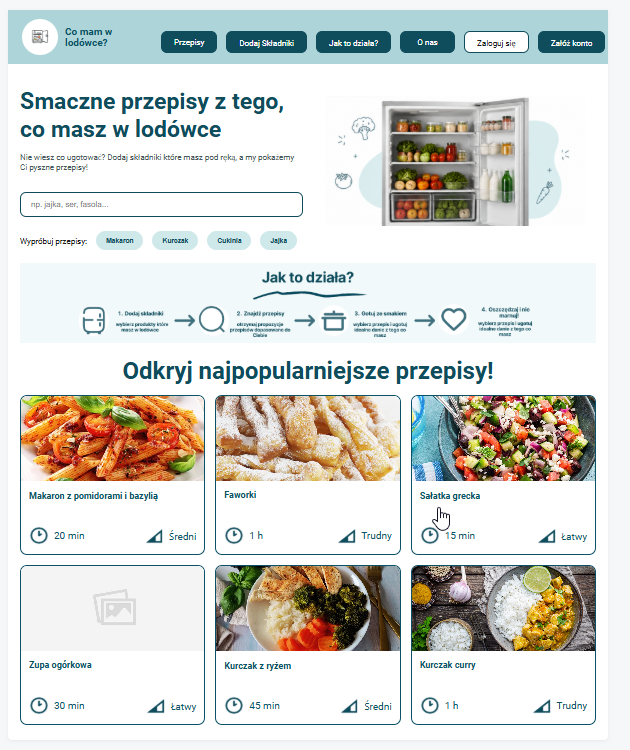
### Wyszukiwarka przepisów
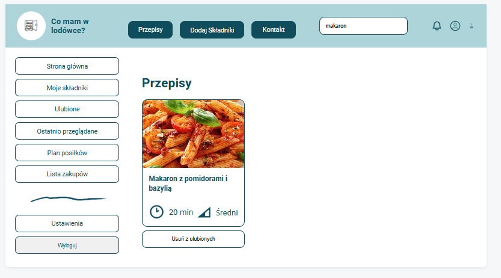
### Szczegóły przepisu
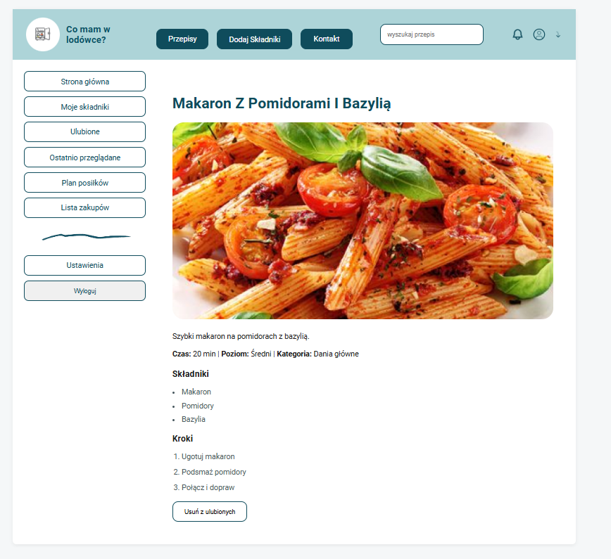

## Ulubione przepisy
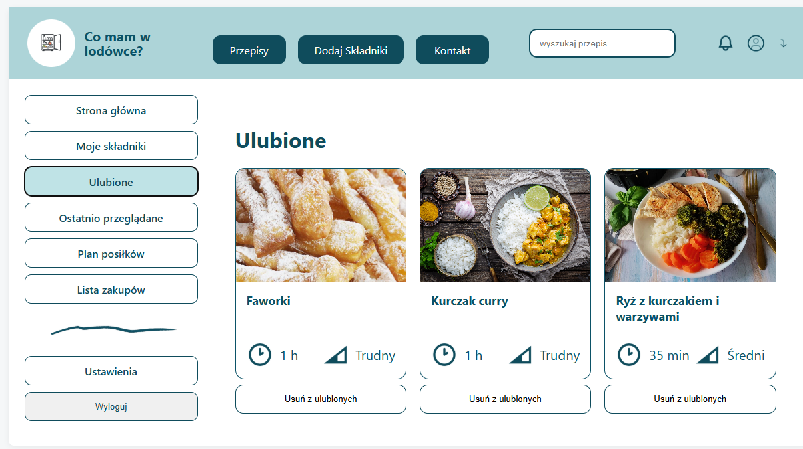

### Logowanie
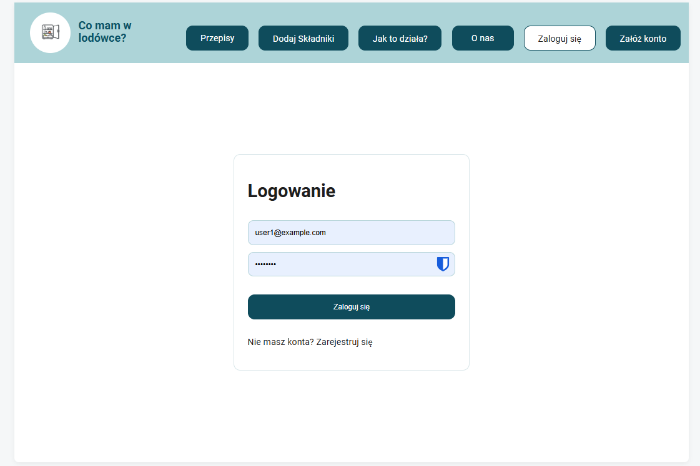

### Rejestracja
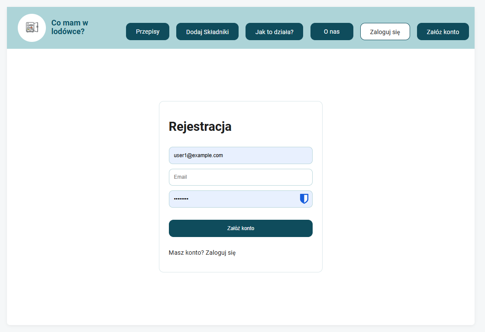

### Strona witająca użytkownika
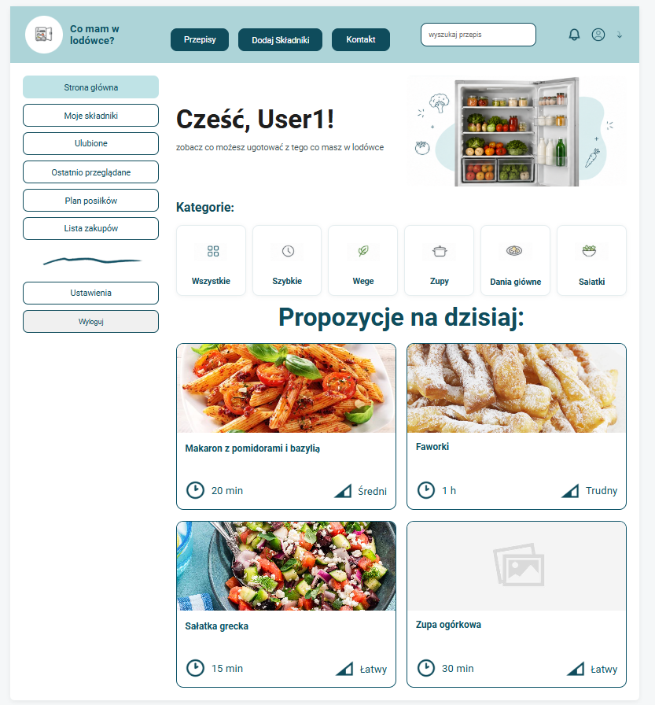

### Podstrona jak to działa 
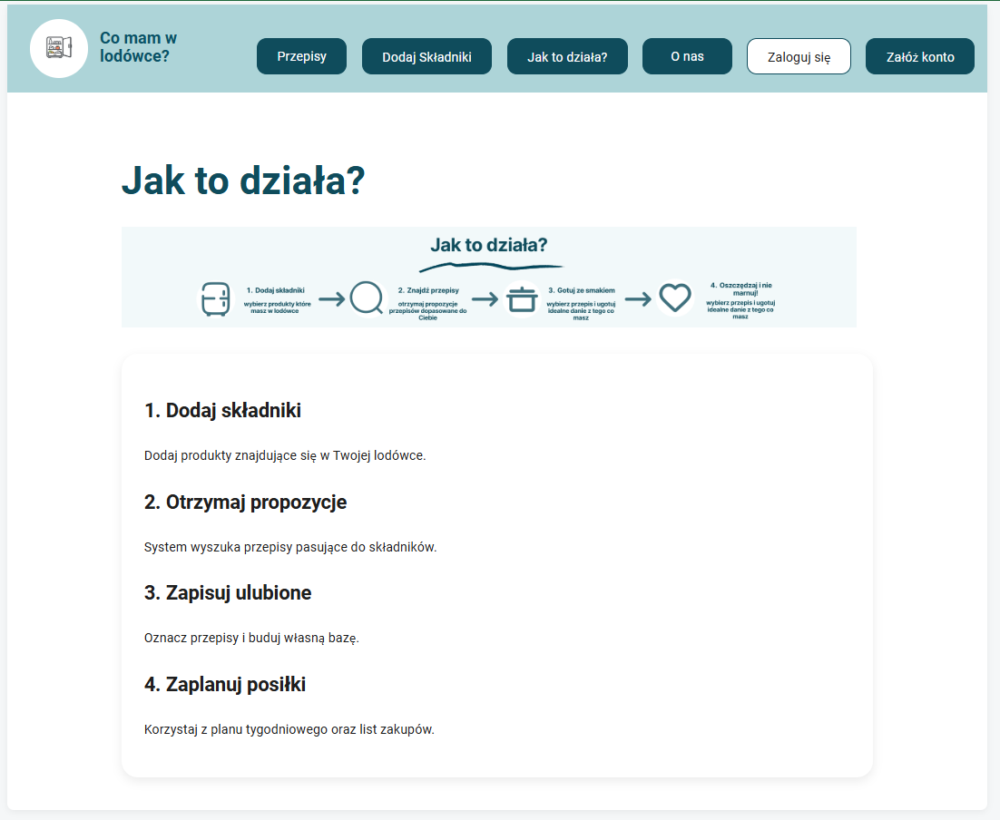

### Podstrona o nas
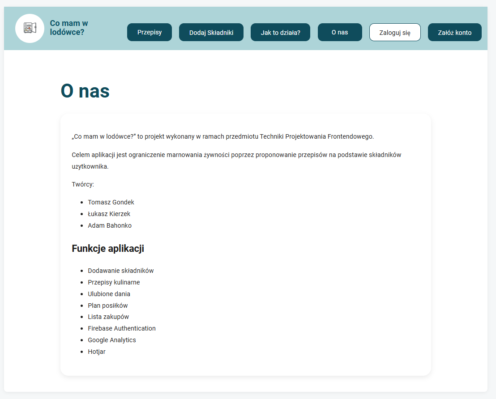

## Integracje

### Firebase
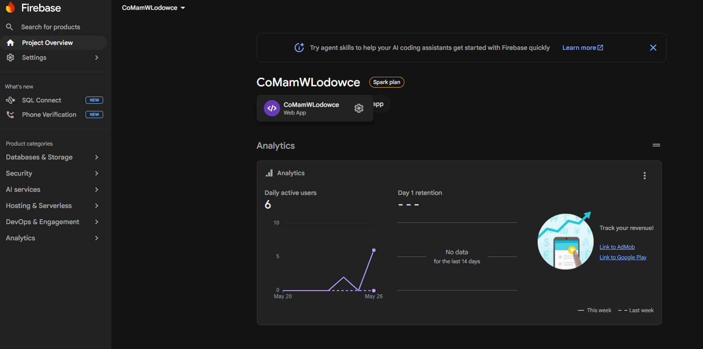
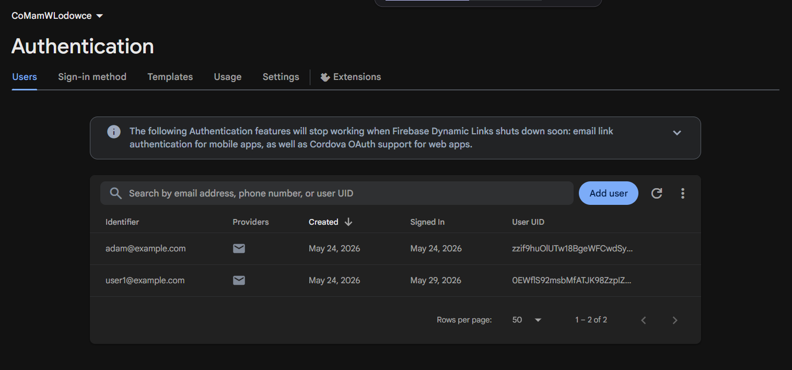

### Google Analytics
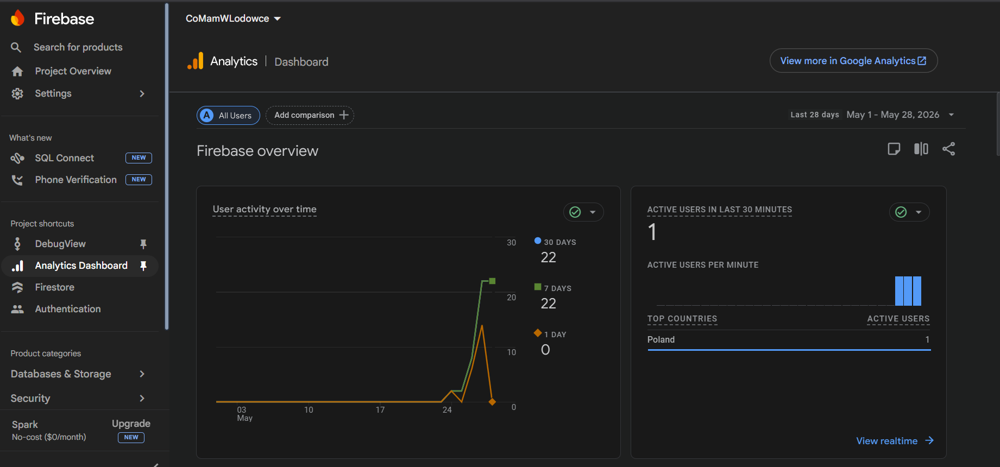
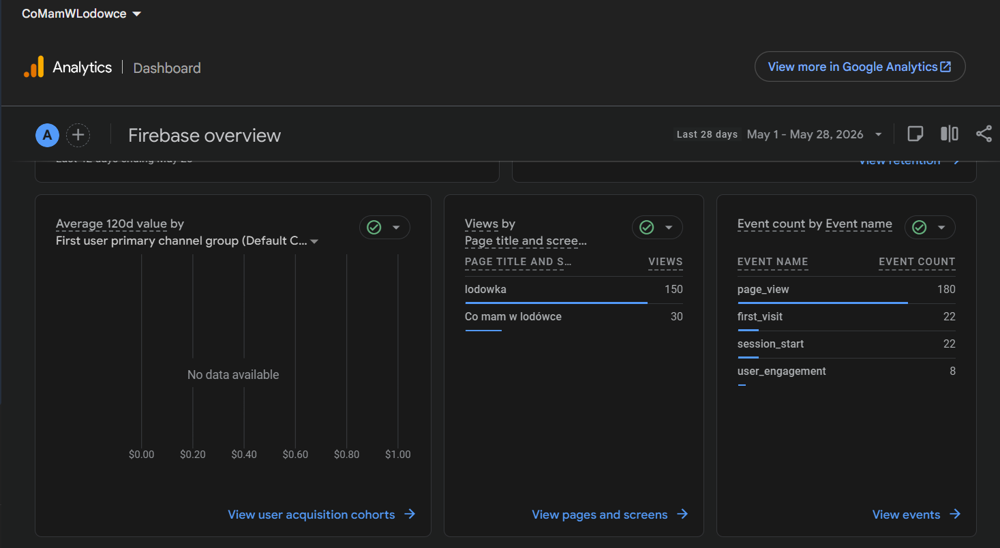
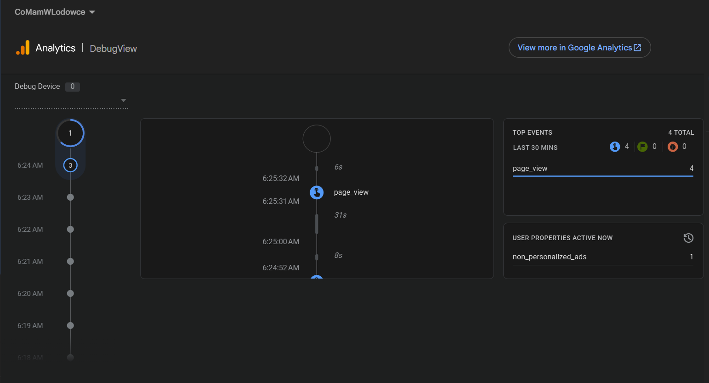

### Hotjar
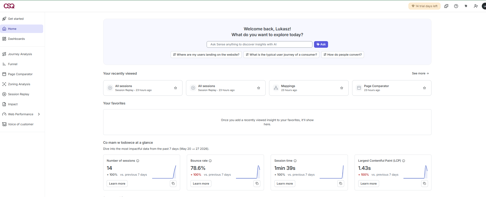

### Deployment na vertel
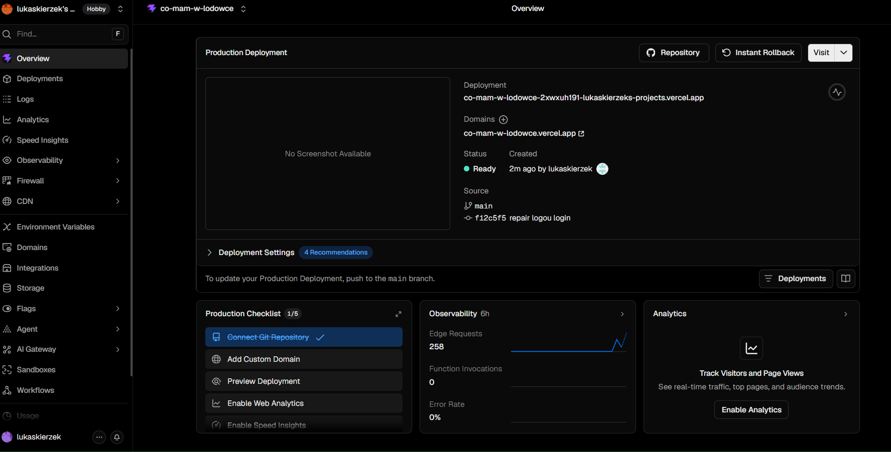
https://co-mam-w-lodowce.vercel.app/


## Autorzy

- Łukasz Kierzek
- Tomasz Gondek
- Adam Bahonko

Politechnika Krakowska  
Techniki Projektowania Frontendowego  
2026
