# 🧊 Co Mam w Lodówce?

Aplikacja webowa wspomagająca zarządzanie zawartością lodówki oraz wyszukiwanie przepisów kulinarnych na podstawie dostępnych składników.

Projekt został wykonany w ramach przedmiotu **Techniki Projektowania Frontendowego**.

---

## 🌐 Wersja produkcyjna

https://co-mam-w-lodowce.vercel.app/

---

## Funkcjonalności

### Użytkownicy

- Rejestracja użytkownika
- Logowanie Email / Password
- Logowanie przez Google Provider
- Wylogowanie
- Edycja danych użytkownika

### Przepisy

- Lista przepisów
- Szczegóły przepisu
- Wyszukiwanie przepisów
- Kategorie przepisów
- Ulubione przepisy
- Ostatnio przeglądane przepisy

### Zarządzanie lodówką

- Dodawanie składników
- Usuwanie składników
- Lista zakupów
- Plan posiłków

### Analityka

- Firebase Analytics
- Hotjar / Contentsquare
- Śledzenie odwiedzanych podstron
- Monitoring aktywności użytkownika

---

##  Architektura aplikacji

Projekt został zbudowany w oparciu o React oraz React Router.

Autoryzacja została zaimplementowana przy użyciu wzorca fasady:

```text
AuthService
│
├── localAuthService
│
└── firebaseAuthService
```

Dzięki temu aplikacja może działać zarówno w trybie lokalnym jak i przy wykorzystaniu Firebase.

---

## 🔐 Firebase

Projekt wykorzystuje następujące usługi Firebase:

- Firebase Authentication
- Google Authentication Provider
- Cloud Firestore
- Firebase Analytics

Dostępne są dwa tryby działania:

### DEV

Dane użytkowników oraz sesja przechowywane są w localStorage.

### DEVPROD / PROD

Autoryzacja realizowana jest przez Firebase Authentication oraz Cloud Firestore.

---

## Logowanie Google

Aplikacja umożliwia logowanie za pomocą konta Google.

Wykorzystane technologie:

- Firebase Authentication
- GoogleAuthProvider
- signInWithPopup()

Przy pierwszym logowaniu konto użytkownika tworzone jest automatycznie.

---

## Struktura projektu

```text
src/
├── components/
│   ├── AnalyticsListener.jsx
│   ├── ProtectedRoute.jsx
│   ├── PublicOnlyRoute.jsx
│   ├── RecipeCard.jsx
│   ├── SideMenu.jsx
│   └── TopNav.jsx
│
├── context/
│   ├── AuthContext.jsx
│   ├── authContextValue.js
│   └── useAuth.jsx
│
├── layouts/
│   └── AuthedLayout.jsx
│
├── pages/
│   ├── HomePage.jsx
│   ├── LoginPage.jsx
│   ├── RegisterPage.jsx
│   ├── WelcomePage.jsx
│   ├── DataPage.jsx
│   ├── RecipeDetailsPage.jsx
│   ├── CategoryPage.jsx
│   ├── AboutPage.jsx
│   ├── ContactPage.jsx
│   ├── HowItWorksPage.jsx
│   └── SettingsPage.jsx
│
├── services/
│   ├── auth/
│   ├── firebase.js
│   ├── dataService.js
│   ├── firestoreUserService.js
│   └── userService.js
│
├── App.jsx
├── main.jsx
└── index.css
```

---

## Technologie

| Technologia | Zastosowanie |
|-------------|-------------|
| React 19 | Interfejs użytkownika |
| Vite 8 | Build oraz development |
| React Router DOM 7 | Routing |
| Firebase Authentication | Uwierzytelnianie |
| Google Provider | Logowanie OAuth |
| Cloud Firestore | Przechowywanie danych |
| Firebase Analytics | Analityka |
| Hotjar / Contentsquare | Heatmapy i nagrania sesji |
| ESLint | Kontrola jakości kodu |
| Vercel | Hosting aplikacji |

---

## Uruchomienie projektu

### Instalacja

```bash
npm install
```

### Tryb developerski

```bash
npm run dev
```

### Tryb Firebase

```bash
npx vite --mode devprod
```

### Build produkcyjny

```bash
npm run build
```

### Podgląd buildu

```bash
npm run preview
```

---

## Zrzuty ekranu

### Strona główna

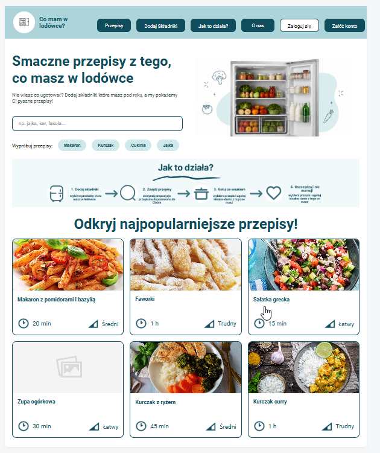

### Jak to działa

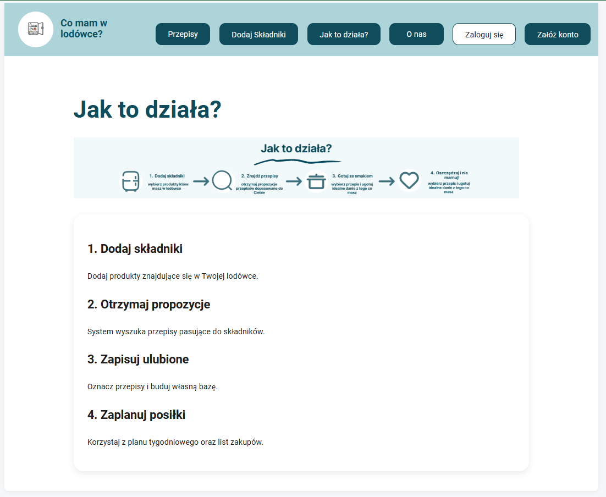

### Logowanie

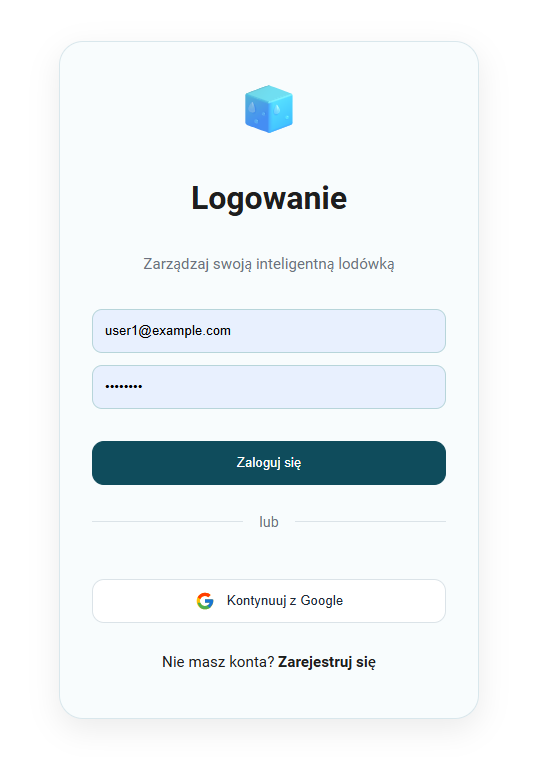

### Rejestracja

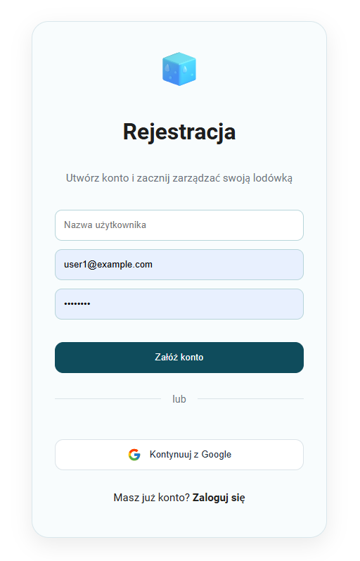

### Welcome Page

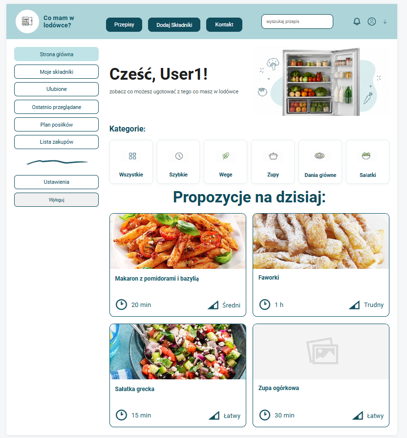

### Szczegóły przepisu

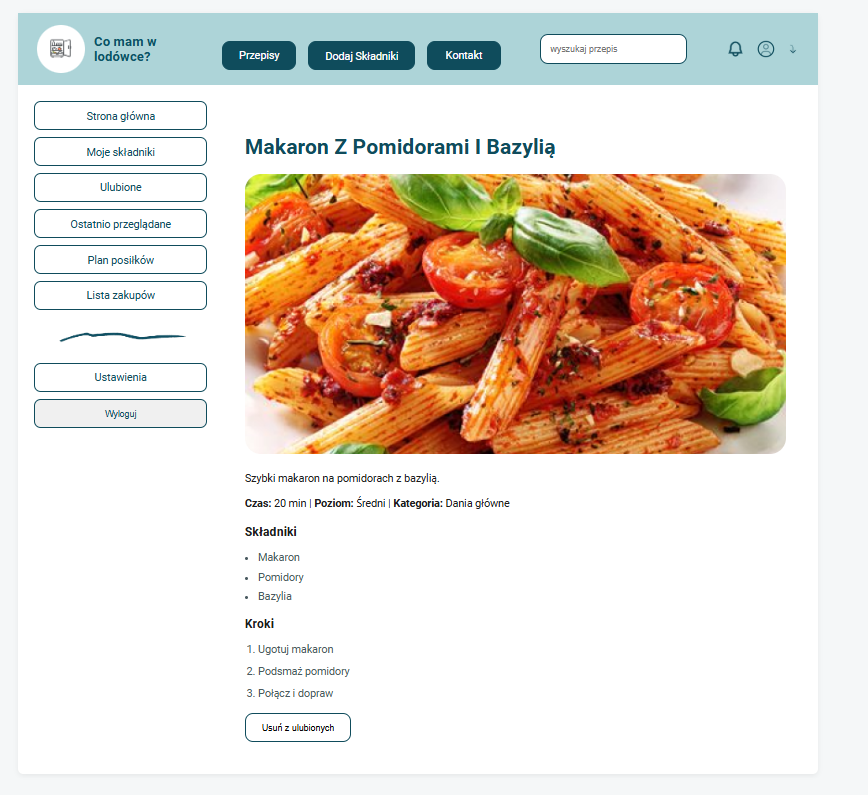

### Ulubione

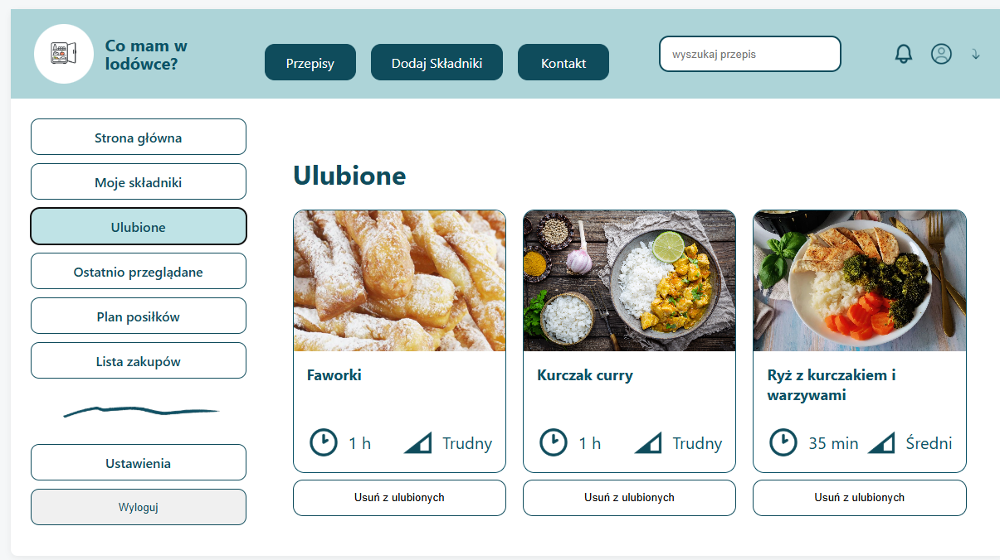

### O nas

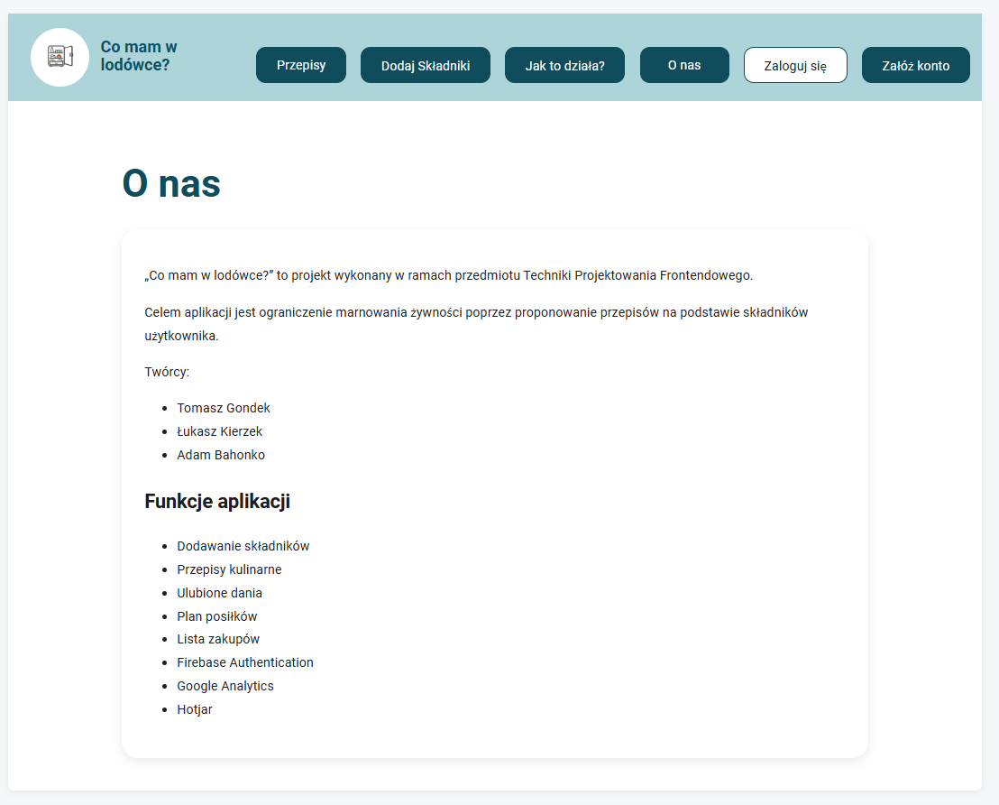

---

## Analityka

### Firebase Analytics

Monitorowanie:

- odwiedzanych stron
- aktywności użytkowników
- zdarzeń aplikacji

#### Firebase Analytics

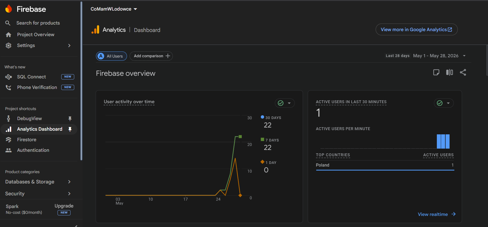

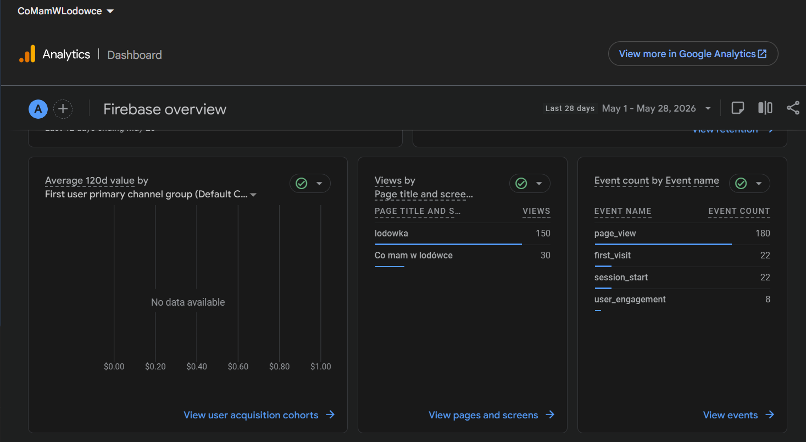

---

### Hotjar / Contentsquare

Monitorowanie:

- heatmap
- nagrań sesji
- zachowania użytkowników

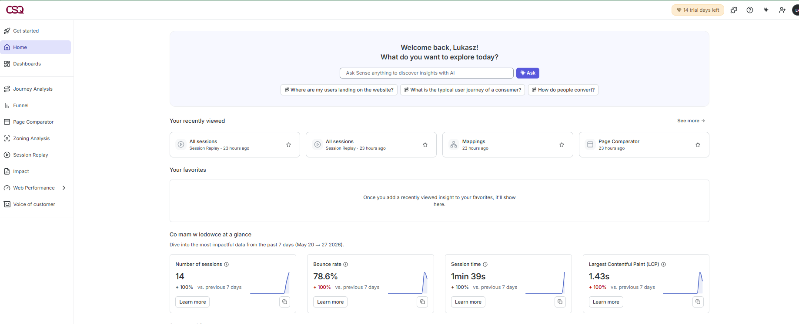

---

## Deployment

Aplikacja została wdrożona przy pomocy platformy Vercel.

### Wdrożenie

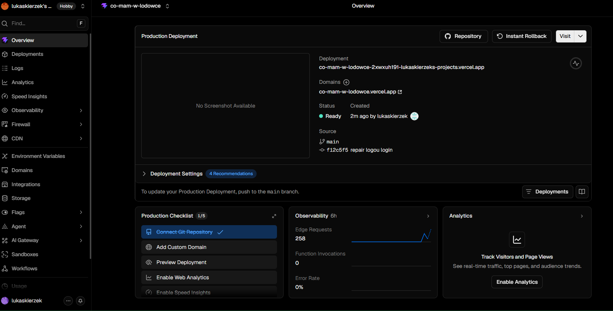

---

## Autorzy

- Łukasz Kierzek
- Tomasz Gondek
- Adam Bahonko

Projekt wykonany w ramach przedmiotu:

**Techniki Projektowania Frontendowego**

Kraków, 2026